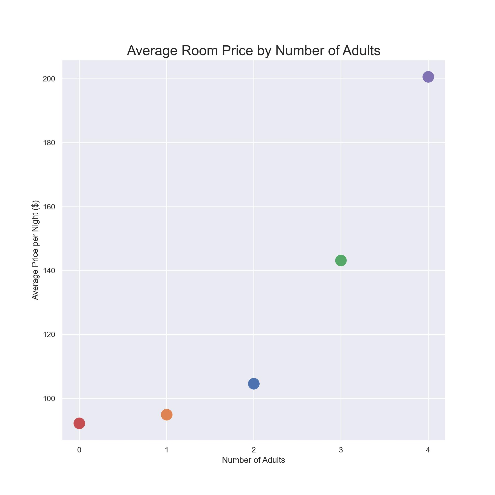
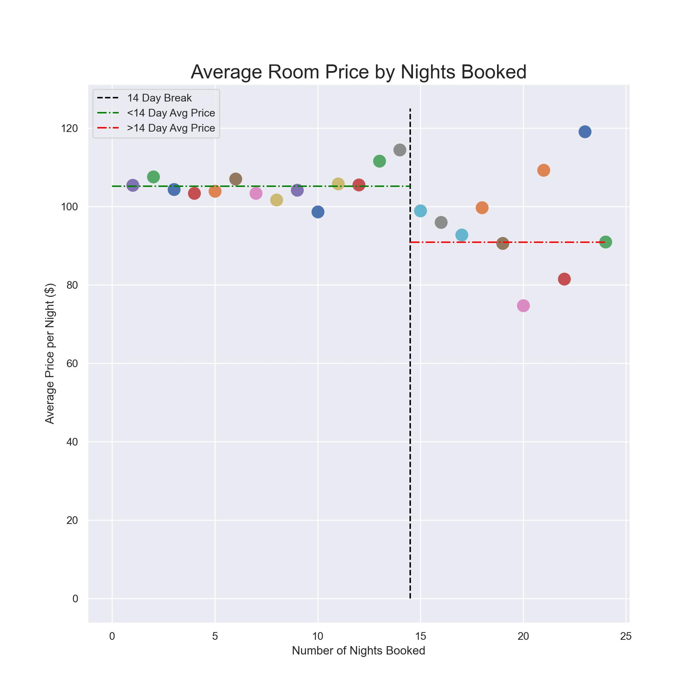

# Hotel Cancellation Predictor

**Author**: [Matthew Duncan](mailto:mduncan0923@gmail.com)

### This is currently a work in progress. For more details on the current status, please check out my [notebook](./Hotel_Cancellation_Notebook.ipynb).

## Overview/Business Understanding
Hotels are often plagued with last minutes cancellations as people's plans change, schedules conflict, or if a better price was found elsewhere. Research from Avvio.com [shows](https://www.avvio.com/2022-cancellation-rate-trends/) that revenue lost due to  hotel room cancellations increased 33% from 2019 to 2022.

The goal of this analysis is to use past information about a particular guest (i.e. have they cancelled in the past?), along with information about their stay and requests (i.e. room type, length of stay), to predict whether the guest is likely to cancel their reservation or not show up at all. 

### Cost of Errors
Being able to predict whether a guest is likely to cancel would be a huge benefit to the hotel. Having an idea of potential cancellations would allow management to better plan for staffing, food budgets, and other commodities that depend on guest levels. 

Precision is important in this analysis as we want to minimize the number of false positives (when the model predicts that a guest will cancel but the guest does not actually cancel) to ensure a high level of customer service for guests. Incorrectly predicting that a guest will cancel when they do not could cause issues with potential overbooking, lack of supplies or staff, or delays in preparing the guests room.

### Confirming Cancellation Statistics with the Data
When the cancellation rate for each year is plotted, we can see that the research from Avvio.com agrees with the results. Only about 15% of guests in the dataset cancelled their reservation in 2017 while about 37% cancelled in 2018.

## Understanding the Data
Data Source: https://www.kaggle.com/datasets/ahsan81/hotel-reservations-classification-dataset?resource=download

The dataset contains 36,275 data entries with no null values in the dataset. There are a total of 19 columns including a unique identifier column `Booking_ID` and the target column `booking_status`. 

Dates range from July 1, 2017 to December 31, 2018. There was a discrepency in the data that had a February 29 date for the year 2018. Since 2018 was not a leap year, the dates have been adjusted to read as the 28th.

The dataset features are primarily numerical with three categorical columns: `type_of_meal_plan`, `room_type_reserved`, `market_segment_type`.

Notable missing features:
- Hotel rating/stars
- Hotel Location
- Size of hotel/number of rooms the hotel has

The average hotel stay is for two adult guests with no children for a long weekend (1 week night and 2 weekend nights) booked about 3 months in advance. The average hotel room price is about $103.

In this repo, I have included the `functions.py` with custom functions needed to run this notebook. I have also the `environment.yml` to ensure that you have the correct environment to run the notebook.

## Actionabale Results of Note:

There are 4 key areas that the exploratory data analysis show to affect cancellation rates and price of rooms:

### Number of Adults

Single adults and groups of 4 have the lowest cancellation rates while 2 or 3 adults per room have the highest amount of cancellations. Groups of 4 adults only cancel their reservation at a rate of about 19% while rooms with no adults or 2-3 adults all cancel more than 30% of the time.

Additionally, when looking at the average price of a room by the number of adults staying, we can see that the price of the room increases as the number of adults increases. The average price of a room for only one adult is about \$95 while the average price of a room for four adults is about \$200.

In order to reduce the likelihood of cancellation while simultaneously increasing revenue, it is suggested to promote bookings for groups of four adults.

### Total Length of Stay

There is a sharp jump in cancellation rates based on total stay after about 11 total nights booked. This makes sense when we think of a booking encompassing an initial Friday night stay and then checking out the Sunday of the following weekend. There's about a 37% cancellation rate for bookings with stays 11 days or less, while stays over 11 days have a cancellation rate of about 81%.

When we look at the total length of a stay in relation to price, we see a similar trend when compared to cancellation rates. The average price per room is pretty consistent despite the length of the stay until the number of nights booked is longer than about 2 weeks. After the two week mark, we start to see some increased volatility in price. The average daily room price for stays less than 2 weeks is \$105 while the average daily price for stays longer than 2 weeks is only about \$90.

In order to reduce the likelihood of cancellation while simultaneously increasing revenue, it is suggested to promote bookings for stays less than 11-14 days.
